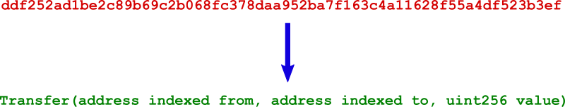

# topic0

## Introduction

This repository is:

1. A public database of Ethereum event log signatures.
2. A set of scripts to generate the database from a [Sourcify](https://github.com/ethereum/sourcify) repository backup. We were able to extract almost __5K event signatures__ from mainnet verified contracts 🎉🎉🎉

## Event what?

When a transaction gets included in an Ethereum block, its execution generates a _receipt_. A receipt contains 0 or more _event logs_. Event logs are composed by an array of _topics_.

For a non-anonymous event log, the first topic, _`topic[0]`_, is used to identify the event signature. It is made of the `keccak256` hash of the event signature.

However, since `topic[0]` is a hash, it is not possible to revert it to the original signature.

This is analogous to how 4byte function decoding works. If you are familiar to that concept, you already got the point.

This database provides the event signature for known topic hashes. From the event signature it is possible to decode the log entry to human-readable elements.

## DB format

This repo follows a similar format to the popular 4bytes repository (https://github.com/ethereum-lists/4bytes).

### `signatures` directory

It contains one file for each signature. The file contains the event signature used to generate the topic hash.

The filename is the hexadecimal string (without the `0x` prefix) of the topic hash. Calculating the `keccak256` the file contents must result in the filename.

For example, the file `signatures/ddf252ad1be2c89b69c2b068fc378daa952ba7f163c4a11628f55a4df523b3ef` contains the popular ERC20 `Transfer(address,address,uint256)` event signature.

### `with_parameter_names` directory

It contains one file for each signature. The file contains a complete event signature which corresponds to the topic hash.

We must say it contains _a_ instead of _the_ because there are multiple signature variations which result in the same topic hash.

Please take a look at the [gotchas](./docs/gotchas.md) page for more details.

The filename is the hexadecimal string (without the `0x` prefix) of the topic hash.

For example, the file `with_parameter_names/ddf252ad1be2c89b69c2b068fc378daa952ba7f163c4a11628f55a4df523b3ef` contains the popular ERC20 `Transfer(address indexed from, address indexed to, uint256 value)` event signature.

## Rebuilding the repo

[Here](./docs/build.md).

## Gotchas

Long explanation [here](./docs/gotchas.md).
